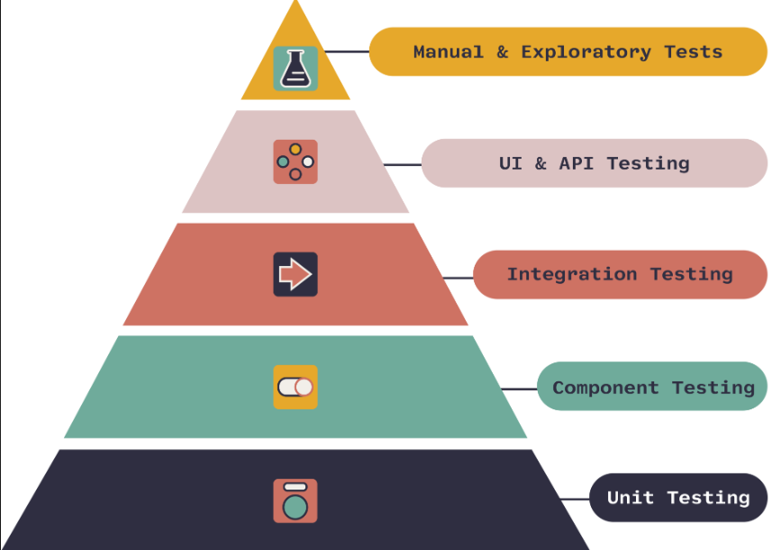

# Aufgabe 1
+ Mit welchen Test Levels hatten Sie bereits zu tun
    1. Unit Testing (Komponententests)
    2. Performance Testing (Leistungstests) mit Lighthouse 
    3. End-to-End Testing (E2E-Tests) mit cypress
    4. API Testing mit Postman 
    5. Testprotokollierung
+ Wann werden Tests ausgeführt
  + Unit Tests: Unit Tests werden in der Regel von Entwicklern geschrieben und laufen kontinuierlich während des Schreibens und Änderns des Codes.
  + System Tests: Diese Tests werden durchgeführt, wenn die gesamte Anwendung als Ganzes zusammengesetzt ist
  
  + Tests können während des gesamten Entwicklungsprozesses durchgeführt werden, nicht nur am Ende. Dies umfasst Unit Tests, Integration Tests, System Tests und andere Arten von Tests

  + Continuous Integration (CI) und Continuous Delivery (CD) ermöglichen es, Tests automatisch bei jeder Code-Änderung durchzuführen, um sicherzustellen, dass keine neuen Fehler eingeführt werden.

+ Haben Sie dedizierte Testing oder QA Teams
    Im ersten und zweiten Lehrjahr bei Noseryoung hatten wir kein feste Testing-Team. Stattdessen wurden Tests entweder von Mitgliedern des Entwicklungsteams, normalerweise zwei Personen aus dem Team, oder individuell von den Entwicklern selbst erstellt und durchgeführt.

    In meinem aktuellen dritten Lehrjahr verfügen wir nun über ein spezialisiertes Testing-Team. Dennoch sind wir nach wie vor dafür verantwortlich, Tests zu erstellen und durchzuführen, wenn wir neue Funktionalitäten entwickeln oder Änderungen an der Anwendung vornehmen.

+ Wie sieht ihr Testing Live Cycle aus
    In den folgenden Schritten werde ich erklären, wie ich beim Testen vorgehe.

    1. **Testplanung**: Bei der Testplaung plane ich was ich mit dem Test erreichen möchte und welche strategien ich verwende werde.Es werden Entscheidungen darüber getroffen, welche Teile der Software getestet werden sollen und wie umfassend die Tests sein sollen.
    2. **Testentwurf**: Hier werden Testfälle und Testdaten erstell. Ich persöhnlich arbeite gerne mit USE-Case die ich auch bei den Testfälle wiederverwenden kann. Testdaten sind die Eingabe- oder Ausgabewerte, die für die Tests verwendet werden
    3. **Testimplementierung**: Dies kann manuell oder automatisiert erfolgen, abhängig von den Anforderungen des Projekts. 
    4. **Testausführung**: Die Tests werden ausgeführt.
    5. **Defektmanagement**: Wenn während der Testausführung Fehler oder Defekte gefunden werden, werden sie erfasst und korrigiert. 
    6. **Testprotokoll**:Am Ende der Testphase wird ein Testbericht erstellt, der die Ergebnisse der Tests zusammenfasst. M einer Meinung ist es übersichtlicher und man kann nachsehen wenn es funktioniert hat. Ich schrieben meistens den Branch, Zeit, Datum, File und Testcase auf.

# Aufgabe 2
+ Versuchen Sie folgende Begriffe einzuordnen und Abhängigkeiten untereinander zu erkennen

**Testing Approach (Testansatz)**: Der Testing Approach bezieht sich auf die grundsätzliche Strategie oder Methode, die für das Testen einer Softwareanwendung gewählt wird. Er legt fest, wie der Testprozess organisiert und durchgeführt wird. Der Testansatz kann auf verschiedene Testing Levels und Testing Types abzielen.
Der gewählte Testing Approach beeinflusst die Auswahl der Testing Levels, die durchgeführt werden. Zum Beispiel kann ein agiler Testansatz dazu führen, dass Continuous Integration Testing durchgeführt wird.

**Testing Levels (Testebenen)**:
Testing Levels (Testebenen) sind verschiedene Ebenen oder Phasen im Prozess des Softwaretests, die nacheinander durchlaufen werden, um sicherzustellen, dass die Software gut funktioniert. Diese Ebenen ermöglichen es, verschiedene Aspekte der Software gründlich zu prüfen.

**Testing Types, Techniques and Tactics (Testarten, Testtechniken und -taktiken)**:
- Testing Types sind unterschiedliche Arten von Tests, die auf spezifische Anforderungen und Aspekte der Software abzielen. Beispiele sind funktionales Testing, nicht-funktionales Testing und exploratives Testing.
- Die Auswahl der Testing Types, Techniques und Tactics hängt von den Anforderungen des Projekts und den Zielen des Testprozesses ab. Sie können in verschiedenen Testing Levels verwendet werden, um sicherzustellen, dass verschiedene Aspekte der Software getestet werden.
- Testtaktiken sind spezifische Herangehensweisen und Strategien, um Tests effizient und effektiv durchzuführen. Beispiel ist Smoke Testing